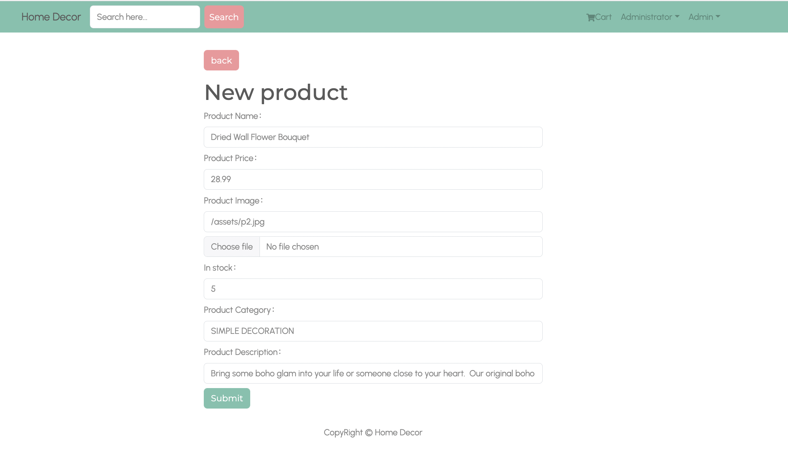
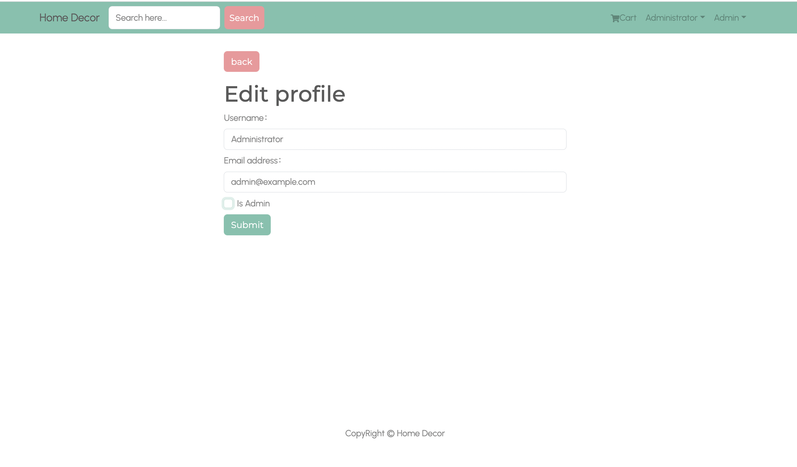

## Application URL

https://home-decor.herokuapp.com/

## GitHub repo:

https://github.com/winny1212/react-eCommerce-app

## Test User Login Details:

Email:  
admin@example.com (Administrator)  
winny@gmail.com  
summer@gmail.com

Password:
123456

## Home Decor Introduction

Home Decor is a two-sided application using react and mern stack. If the user has admin authorization, he/she can buy, comment,edit,delete products as well as creating a new product. If user is a normal user, he/she can only buy and comment the products.

## What it is Home Decor and website preview

- Homepage

  - _View available listing_: Listing page can be viwed by anyone including unregistered users.
  - _Search product_: User can search product including unregistered users.
  - _Showing top 3 popular products by carousel_
    

- Product details page
  - _View product details_: Product details can be viwed by anyone including unregistered users.
  - _Comment product_: After login, user can comment and rate product.
  - _Add to cart_:After login, user add product to cart.
    
- Login Page
  
- Sign up page (Test administrator user : admin@example.com ; password: 123456)
  
- User profile edit page
  - _Update user profile_:After login, user can update their username, email, password.
  - _Update username on navbar_:After updated, username will be change on the navbar automatically.
    
- Cart page
  - _Showing cart information_: Showing shopping cart information and allow user going to checkout step.
    
- shipping page
  - _Add shipping information_: User need to fill in their shipping information here. And the stepper will be shown above the form.
    
- OrderComfirm page
  
- Order details page
  
- Product list page

  - _Update product list_:If user has admin authorization, he/she can edit product details,delete the product or create a new product.

  

- Create new product page

  - _Create new product list_:If user has admin authorization, he/she can edit product details,delete the product or create a new product.
    

- Edit existing product page
  - _Edit existing product list_:If user has admin authorization, he/she can edit product details.
    
- User list page  
  If user has admin authorization, he/she can edit user information including changing user to an administrator or not or delete a user information.
  
- User edit page  
  If user has admin authorization, he/she can edit user information including changing user to an administrator or not.
  
